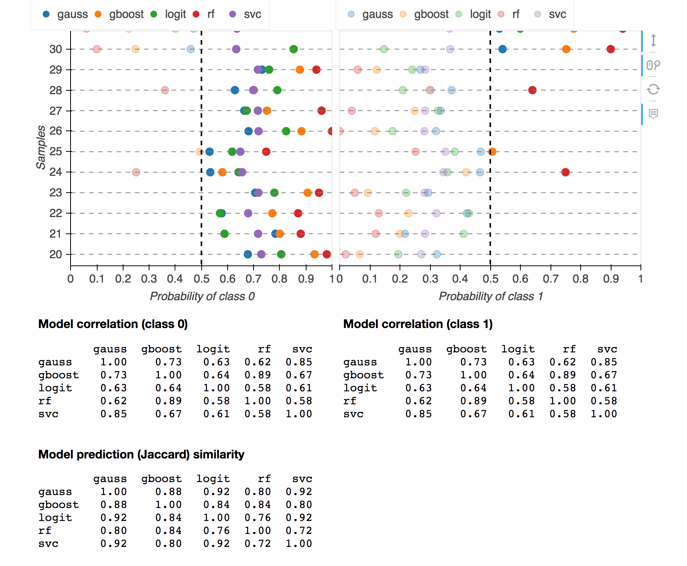

Analyze interactively predictions using different probabilistic machine learning methods.

The use case is as follows. We start by modeling a data set. This module models the data using different probabilitisic classifiers.  A probabilistic machine classifer associates a probability with each prediction.

Once the model is built, we use it to analyze test data interactively, particularly seeking answers to these questions:

1. How probable are predicted outcomes by different classifiers?
2. How agreeable are the classifiers for the test data set?

## Features

- Visualize probability of prediction of different ML algorithms for each (test) data point.
This allows us to see how probable predictions are, and how much different algorithms agree.

- For each data point, we can see (1) probability of prediction, (2) confidence estimate of the prediction being a true positive, (3) confidence estimate of the prediction being a false positive.

- Show pairwise correlation of and similarity of ML algorithms.

- Examine each data point.


## Usage

Model building
```
import pandas
from sklearn.model_selection import KFold
from probably import Model
from sklearn.ensemble import GradientBoostingClassifier

model = Model(
	data = 'data/admission.csv',
	features = ['gre', 'gpa', 'rank'],
	target = 'admit',
	cv = KFold(10,True),
	classifiers = [ 'rf', 'logit', ('gb', GradientBoostingClassifier()) ],
)
model.save('admission.model')

# data = pandas.read_csv('data/admission.csv')
# test_data = data.sample(50, random_state=42)[['gre', 'gpa', 'rank']]
# model.predict(test_data)
```

Load model and predict new data
```
import pandas
data = pandas.read_csv('data/admission.csv')
test_data = data.sample(20)[['gre', 'gpa', 'rank']]

from probably import Model
model = Model(saved_model = 'admission.model')
model.predict(test_data, 'prediction_saved.html')
```

The output is an html file (built using Python Bokeh), from which you can
interactively analyze predicted data.

## Required Python 3 packages

- bokeh
- numpy
- pandas
- scipy
- scikit-learn

## Supported classification algorithms

- Gaussian process
- Gradient boosting
- Logistic regression
- Random forest
- Support vector machine

## Example

##### Graduate school admission data set

Prediction of [admission into UCLA's graduate school](https://stats.idre.ucla.edu/r/dae/logit-regression/) based on GRE score, GPA, and undergraduate school ranking.

As an example, the figure shows a data point with GRE=800, GPA=4.0, undergrad school ranking = 3.
For this data point, the probability of being accepted (using the default random forest classifier with 50 trees) is 0.89.  Further, 86% of true positives have probabilities less than or equal to 0.89; and only 9% of false positives have probabilities greater than 0.89.  These 3 numbers provides additional information about the prediction.


