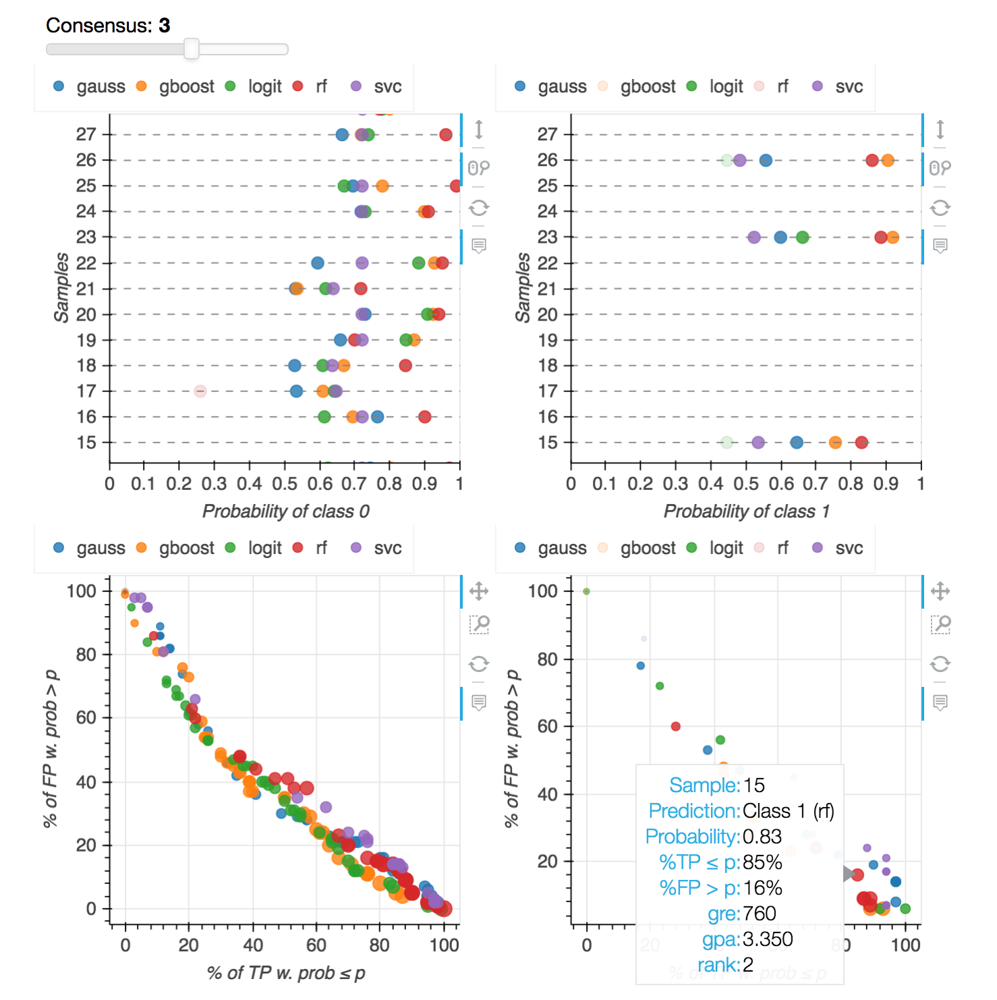

Machine learning methods often provide predictions without justification.  Fortunately, a few methods provide estimates of probabilities of their predictions being correct.  While probabilistic information can be helpful, it must be used carefully.

This module helps users make sense of probabilistic estimates provided by different machine learning methods.  Naturally, we want to know the answers to a few basic questions:

1. How probable are predicted outcomes by different classifiers?
2. How agreeable are the classifiers' predictions?
3. What can we learn from prediction probabilities?

The goal of this module is to get answers to these and other questions to facilitate the decision making process.

## Usage

Model building
```
import pandas
from probably import Model
from sklearn.model_selection import KFold
from sklearn.ensemble import GradientBoostingClassifier

# We start by building a model.  We specify a dataset, features, the target variable,
# and the classifiers that we be used.  There are 5 built-in classifiers; users can
# also create and provide their own classifiers.

model = Model(
	data = 'data/admission.csv',
	features = ['gre', 'gpa', 'rank'],
	target = 'admit',
	cv = KFold(10,True),
	classifiers = [ 'rf', 'logit', ('gb', GradientBoostingClassifier()) ],
)

# A model can be saved for later usage.
model.save('admission.model')

# Start the analysis
# model.predict(test_data)
```

Load model and predict new data
```
import pandas
data = pandas.read_csv('data/admission.csv')
test_data = data.sample(20)[['gre', 'gpa', 'rank']]

from probably import Model
model = Model(saved_model = 'admission.model')         # Load a previously saved model.
model.predict(test_data, 'prediction_saved.html')
```

## Execution and visualization

Use the bokeh server to serve your app from the command line:
```
bokeh serve --show yourapp.py
```

This will open a web browser, where the data and predictions can be analyzed and visualized.  It is important to know not just the probability of each prediction, but also the contexts of such prediction.  The most important 3 attributes associated with each prediction are:

- Probability p of the data point being predicted for a specific label/class.
- The percentage of true positives (with respective to that label/class) with predicted probabilities less than the probability p.
- The percentage of false positives (with respective to that label/class) with predicted probabilities greater than the probability p.

As 0.8 probability predicted by one method can be very different from the same probability predicted by another method, understanding what this probability means in the context of true and false positives predited by the same method can make it easier to make decisions.

## Required Python 3 packages

- bokeh
- numpy
- pandas
- scipy
- scikit-learn

These packages can be easily installed if you use the Anaconda distribution.

## Supported classification algorithms

- Gaussian process (gauss)
- Gradient boosting (gboost)
- Logistic regression (logit)
- Random forest (rf)
- Support vector classification (svc)

## Example

[Dataset](https://stats.idre.ucla.edu/r/dae/logit-regression/): admission into UCLA's graduate school based on GRE score, GPA, and undergraduate school ranking.

The snapshot below was taken from the visualization after running the code above.  This snapshot shows a data point with GRE=760, GPA=3.35, undergrad school ranking = 2.  The data point was predicted by a random forest classifier to be admited (class 1), with probability 0.83.  Further, 85% of true positives had probabilities less than or equal to 0.83; and 16% of false positives had probabilities greater than 0.83.

In this snapshot, only data with predictions agreed by 3 or more methods were selected.  The visualization allows users to zoom, pan, hide/unhide each method.  This can be very helpful for analyzing one method or comparing two different methods.


